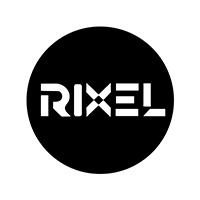

# Rixel Studio — Official Portfolio Website

Official high-performance portfolio website for **Rixel Studio** (Brand Identity, Motion Graphics & Creative Direction).



---

## 🌟 Features (মূল সুবিধাসমূহ)
- **100% Mobile Responsive:** ডেস্কটপ, ট্যাবলেট ও মোবাইলের জন্য অপ্টিমাইজড লেআউট।
- **Interactive 3D Spatial Scene:** Three.js চালিত ইন্টারঅ্যাক্টিভ থ্রিডি রিং ও ক্রিস্টাল মডেল (মাউস কার্সার ও মোবাইল টাচে স্মুথলি মুভ করে)।
- **Curated Selected Works (12 Projects):** ক্যাটাগরি ফিল্টার এবং সম্পূর্ণ ইন্টারঅ্যাক্টিভ **Lightbox Modal** প্রিভিউ।
- **Services Matrix:** ৫টি মূল সার্ভিস এবং ওয়ান-ক্লিক ফর্ম অটো-সিলেক্ট।
- **Dual Currency Budget Switcher:** BDT (৳) ও USD ($) কারেন্সি টগল এবং ডাইনামিক বাজেট টায়ার।
- **Direct Lead Intake Form:** স্বয়ংক্রিয় মেইল ড্রাফটিং (`ourrixelstudio@gmail.com`) এবং ওয়ান-ক্লিক **WhatsApp Chat** ইন্টিগ্রেশন (`+880 1849-697850`)।
- **Mobile Bottom App Navigation:** মোবাইলে ব্যবহারকারীদের জন্য ফিক্সড অ্যাপ-স্টাইল ন্যাভিগেশন বার।

---

## 🛠️ Tech Stack
- **HTML5 & Semantic Markup**
- **Tailwind CSS (Obsidian Luminescence Dark Palette)**
- **Three.js (r125 WebGL Canvas)**
- **Google Fonts:** Sora, Inter, Space Grotesk & Material Symbols Outlined

---

## 🚀 GitHub-এ আপলোড এবং ফ্রি হোস্টিং করার নিয়ম (GitHub Pages Guide)

আপনি গিট না জেনেও ব্রাউজার দিয়ে খুব সহজেই এটি গিটহাবে আপলোড করে লাইভ ফ্রি হোস্ট করতে পারেন:

### ধাপ ১: GitHub Repository তৈরি করুন
1. [github.com](https://github.com)-এ যান এবং আপনার অ্যাকাউন্টে লগইন করুন।
2. উপরে ডানপাশে থাকা **`+`** আইকনে ক্লিক করে **New repository** সিলেক্ট করুন।
3. **Repository name** দিন (যেমন: `rixel-studio` অথবা আপনার নাম অনুযায়ী `portfolio`)।
4. রিপোজিটরিটি **Public** সিলেক্ট করুন।
5. নিচে **Create repository** বাটনে ক্লিক করুন।

---

### ধাপ ২: ফাইল আপলোড করুন (Drag & Drop)
1. নতুন রিপোজিটরি খোলার পর পেজের মাঝখানে **"uploading an existing file"** লিংক দেখতে পাবেন, সেখানে ক্লিক করুন।
2. এই ফোল্ডার থেকে নিচের ফাইলগুলো টেনে এনে ব্রাউজারে ছেড়ে দিন (Drag & Drop):
   - `index.html`
   - `logo.png`
   - `200 by 200.png`
   - `404.html`
   - `.nojekyll`
   - `README.md`
3. পেজের নিচে **Commit changes** বাটনে ক্লিক করুন। ফাইলগুলো আপলোড হয়ে যাবে।

---

### ধাপ ৩: GitHub Pages দিয়ে ওয়েবসাইট লাইভ করুন (১ মিনিটে ফ্রি ডোমেইন)
1. আপনার রিপোজিটরির উপরের মেনু থেকে **Settings** ট্যাবে যান।
2. বাম পাশের মেনু থেকে **Pages** অপশনে ক্লিক করুন।
3. **Branch** ড্রপডাউনে `None`-এর জায়গায় **`main`** সিলেক্ট করুন।
4. ফোল্ডার হিসেবে `/(root)` রেখে পাশে থাকা **Save** বাটনে ক্লিক করুন।
5. ১ থেকে ২ মিনিট অপেক্ষা করে পেজটি রিফ্রেশ দিন।
6. উপরে আপনার ওয়েবসাইটের লাইভ লিংক দেখতে পাবেন:
   👉 **`https://<your-username>.github.io/<repository-name>/`**

---

## 📁 প্রজেক্ট ফাইল স্ট্রাকচার
```text
├── index.html       # মূল ওয়েবসাইট পেজ
├── logo.png         # ক্রিস্প রিক্সেল স্টুডিও লোগো
├── 200 by 200.png   # অরিজিনাল লোগো ফাইল
├── 404.html         # কাস্টম ব্র্যান্ডেড 404 পেজ
├── .nojekyll        # গিটহাব পেজেস বাইপাস ফাইল
├── .gitignore       # গিট ইগনোর কনফিগ
└── README.md        # ডিরেক্টরি পরিচিতি ও গাইড
```

---

© 2025 Rixel Studio. All rights reserved.
